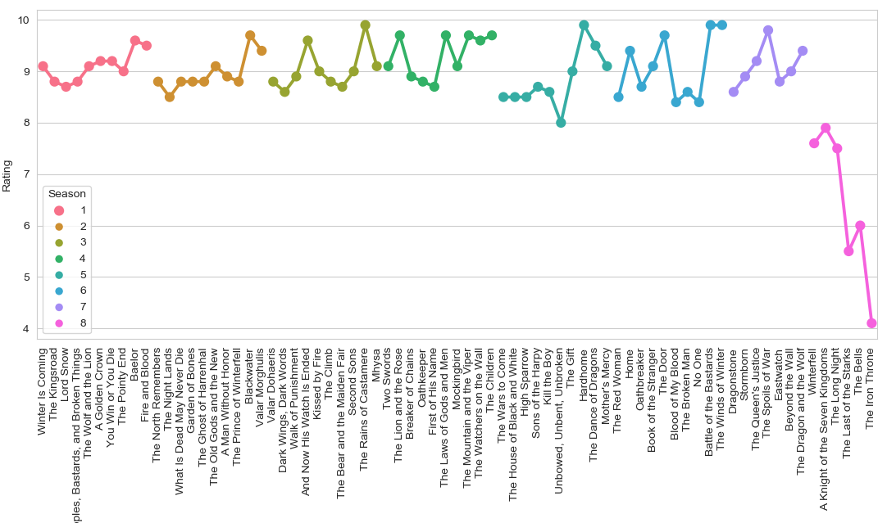

# IMDb Series Scraper
Command console tool for scraping all individual IMDb scores of all episodes of a series and plot them as lineplot.

## Requirements
```python
requests==2.25.1
numpy==1.20.2
pandas==1.3.4
matplotlib==3.3.4
seaborn==0.11.1
lxml==4.7.1
bs4==0.0.1
```

## Usage
Use the `-t` flag to provide the name of a series. The program is making use of IMDb's search function, so the name doesn't have to be spelled completely correct.

Example:
```console
$ python scraper.py -t "Game of Thrones"
```
Output:
```console
Found IMDb ID: tt0944947
Scraping Season 1
Scraping Season 2
Scraping Season 3
Scraping Season 4
Scraping Season 5
Scraping Season 6
Scraping Season 7
Scraping Season 8
```
